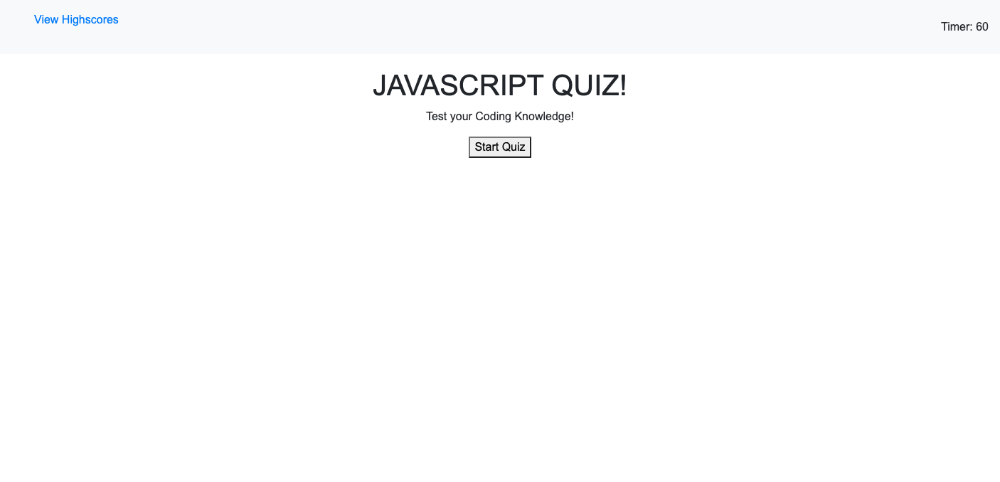

# Code-Quiz

# Description

This project allows the user to play a 4 question Javascript quiz. The user will select an answer to each question and then is able to see their scores at the end of the quiz. The project features fully working HTML, CSS and Javascript files. 

This project was a huge challenge as it was my first project that primarily relied on javascript for its functionality. I think that from this experience, I'll be able to build out better projects from here on out. 

## Table of Contents
 * [Installation](#Installation) 
 * [Usage](#Usage)
 * [Credits](#Credits)
 * [License](#License)

## Installation

1. visit https://www.tutorialspoint.com/javascript/index.htm

## Usage
*  Main Page

## Credits
1. https://www.tutorialspoint.com/javascript/index.htm
2. https://www.w3schools.com
3. https://www.easyprogramming.net/javascript/js_random_password_generator.php

## License
...